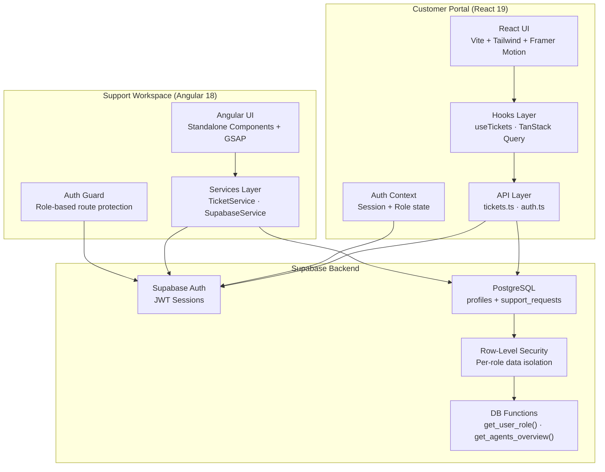
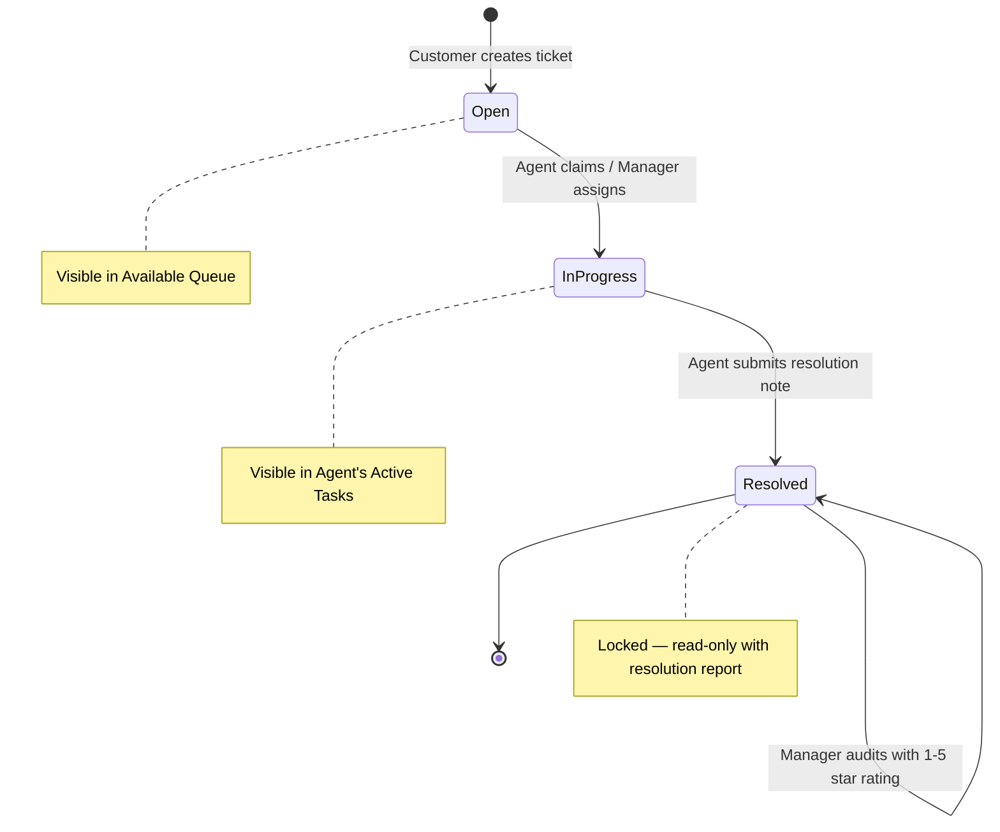
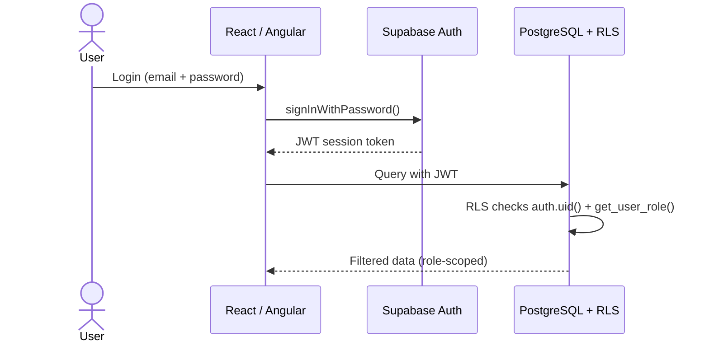

# 🛡️ Customer Support Operations Platform

An enterprise-grade, dual-frontend operations platform built with a shared PostgreSQL / Supabase backend, cryptographic Row-Level Security (RLS), Role-Based Access Control (RBAC), server-side pagination, multi-criteria filtering, and Freshdesk-inspired UI.

---

## Table of Contents

- [Executive Overview](#-executive-overview)
- [System Architecture](#-system-architecture)
- [Database Schema](#-database-schema)
- [Row-Level Security (RLS) Matrix](#-row-level-security-rls-matrix)
- [Role & Responsibilities Matrix](#-role--responsibilities-matrix)
- [Features](#-features)
- [Form Validation Rules](#-form-validation-rules)
- [Security Architecture](#-security-architecture)
- [Environment Setup](#-environment-setup)
- [Local Development](#-local-development)
- [Deployment](#-deployment)

---

## 🌟 Executive Overview

The platform provides a unified operations ecosystem connecting two distinct interfaces to a single live database:

1. **Customer Portal (React 19 + Vite + TanStack Query v5 + Framer Motion + Tailwind CSS)**
   - End-customers create support requests, track live resolution progress, search/filter inquiries, review official agent resolution summaries, and manage security credentials.
   - Glassmorphic **Electric Indigo (`#6366f1`)** theme.

2. **Support Workspace (Angular 18 Standalone + Signals + GSAP + Tailwind CSS)**
   - Support agents triage queue tickets and operations managers supervise workload, provision staff, and audit resolution quality with 1–5 star reviews.
   - Glassmorphic **Operations Emerald (`#10b981`)** theme.

---

## 🏗️ System Architecture



### Ticket Lifecycle



### Authentication Flow



---

## 🗄️ Database Schema

### `profiles` Table

| Column | Type | Constraints | Description |
|:-------|:-----|:------------|:------------|
| `id` | `uuid` | PK, FK → `auth.users.id` | Matches Supabase Auth user ID |
| `full_name` | `text` | NOT NULL | Display name |
| `role` | `text` | NOT NULL, CHECK | `'customer'` \| `'agent'` \| `'manager'` |
| `is_active` | `boolean` | DEFAULT `true` | Whether the staff account is active |
| `created_at` | `timestamptz` | DEFAULT `now()` | Auto-set on creation |

> **Auto-provisioning:** A PostgreSQL trigger (`handle_new_user()`) runs as `SECURITY DEFINER` on `auth.users` INSERT to automatically create a `profiles` row with `role = 'customer'`.

### `support_requests` Table

| Column | Type | Constraints | Description |
|:-------|:-----|:------------|:------------|
| `id` | `uuid` | PK, DEFAULT `gen_random_uuid()` | Unique ticket identifier |
| `customer_id` | `uuid` | FK → `profiles.id`, NOT NULL | Ticket owner |
| `title` | `text` | NOT NULL, 5–100 chars | Ticket subject line |
| `description` | `text` | NOT NULL, 10–2000 chars | Detailed issue description |
| `category` | `text` | NOT NULL | `Technical Issue` \| `Billing & Plans` \| `Account Access` \| `Feature Request` |
| `priority` | `text` | NOT NULL | `low` \| `medium` \| `high` \| `urgent` |
| `status` | `text` | NOT NULL, DEFAULT `'open'` | `open` \| `in_progress` \| `resolved` |
| `assigned_to` | `uuid` | FK → `profiles.id`, NULLABLE | Assigned agent (null = unassigned) |
| `resolution_note` | `text` | NULLABLE | Agent's resolution summary (locks ticket) |
| `manager_feedback` | `text` | NULLABLE | Manager's quality audit comment |
| `manager_rating` | `integer` | NULLABLE, CHECK 1–5 | Manager's 1–5 star quality rating |
| `created_at` | `timestamptz` | DEFAULT `now()` | Ticket creation timestamp |
| `updated_at` | `timestamptz` | NULLABLE | Last update timestamp |

### Key Database Functions

| Function | Type | Description |
|:---------|:-----|:------------|
| `get_user_role()` | `SECURITY DEFINER` | Returns current user's role from `profiles` — used by RLS policies to avoid infinite recursion |
| `get_agents_overview()` | RPC | Returns agent list with `total_assigned`, `total_resolved`, `avg_rating`, `total_ratings` for the manager panel |
| `toggle_agent_status()` | RPC | Manager toggles an agent's `is_active` flag |
| `delete_staff_agent()` | RPC | Manager removes an agent account and unassigns their tickets |
| `handle_new_user()` | Trigger | Auto-creates a `profiles` row when a new `auth.users` row is inserted |

---

## 🔐 Row-Level Security (RLS) Matrix

RLS is **enabled and enforced** on both `profiles` and `support_requests`. Even if a user manipulates client-side code or sends raw REST requests, PostgreSQL enforces these policies at the SQL engine level.

### `profiles` Table

| Policy | Role | Action | Rule |
|:-------|:-----|:-------|:-----|
| Users can view own profile | All | SELECT | `id = auth.uid()` |
| Staff can view all profiles | Agent / Manager | SELECT | `get_user_role() IN ('agent', 'manager')` |
| Users can update own profile | All | UPDATE | `id = auth.uid()` + WITH CHECK prevents role/is_active escalation |
| No INSERT policy | — | INSERT | Handled by `SECURITY DEFINER` trigger only |
| No DELETE policy | — | DELETE | Blocked — users cannot delete profiles |

### `support_requests` Table

| Policy | Role | Action | Rule |
|:-------|:-----|:-------|:-----|
| Customers view own requests | Customer | SELECT | `customer_id = auth.uid()` |
| Staff view all requests | Agent / Manager | SELECT | `get_user_role() IN ('agent', 'manager')` |
| Customers insert own requests | Customer | INSERT | WITH CHECK: `customer_id = auth.uid()` |
| Customers update own requests | Customer | UPDATE | Restricted to `title`, `description`, `category`, `priority` only — cannot modify `status`, `assigned_to`, `resolution_note`, or manager fields |
| Staff update requests | Agent / Manager | UPDATE | Full update access for workflow progression |
| No DELETE policy | — | DELETE | Blocked — tickets cannot be deleted |

---

## 👥 Role & Responsibilities Matrix

| Role | Application | Test Email | Password | Capabilities |
|:-----|:------------|:-----------|:---------|:-------------|
| **Customer** | Customer Portal (React) | `customer@portal.com` | `password123` | Create tickets, view own history, multi-filter (status / priority / category / date), search, review resolution notes, edit profile & password |
| **Support Agent** | Support Workspace (Angular) | `agent@support.com` | `password123` | Triage unassigned queue, claim tickets, update progress (`Open` → `In Progress` → `Resolved`), lock with resolution reports, manage profile |
| **Support Manager** | Support Workspace (Angular) | `manager@support.com` | `password123` | Full queue oversight, multi-filter + paginate, assign agents, provision/toggle/delete agent accounts, audit resolutions with 1–5 star QA ratings, analytics dashboard |

---

## ✨ Features

### Pagination
- **Server-side pagination** with Supabase `.range()` — 10 tickets per page.
- Page numbers with ellipsis for large result sets.
- "Showing X–Y of Z tickets" count display.

### Multi-Criteria Filtering
- **Status** — All / Open (includes In Progress) / Resolved
- **Priority** — All / Urgent / High / Medium / Low
- **Category** — All / Technical Issue / Billing & Plans / Account Access / Feature Request
- **Date Range** — All Time / Last 7 Days / Last 30 Days / Last 90 Days
- **Keyword Search** — Searches title, description, and category (server-side `ilike` in customer portal)
- All filters compose with **AND logic** and a "Clear All" button resets state.

### Freshdesk-Inspired UI
- **Table/List view** (default) with column headers: ID, Subject, Category, Status, Priority, Created
- **Card view** toggle alternative
- Dense, professional ticket queue with compact badges

### Security Hardening
- No hardcoded API keys — all credentials loaded from `.env` / `environment.ts`
- `getProfile()` / `updateProfile()` bound to authenticated session user (no arbitrary `userId` parameter)
- Explicit `customer_id` filter on all customer queries (defense-in-depth on top of RLS)
- Explicit column selection (no `SELECT *`) — only requested fields are returned

---

## 📋 Form Validation Rules

All inputs validated with Zod schemas:

| Field | Rules |
|:------|:------|
| **Email** | RFC format, lowercase trimmed |
| **Password** | Min 8 chars, 1 uppercase, 1 lowercase, 1 digit, 1 special character |
| **Ticket Title** | 5–100 characters, trimmed |
| **Ticket Description** | 10–2,000 characters, trimmed |
| **Category & Priority** | Strict enum constraints |
| **Resolution Note** | Min 10 characters (locks ticket permanently) |
| **Manager Feedback** | Min 5 characters, 1–5 star rating |

---

## 🔒 Security Architecture

### Defense-in-Depth Layers

```
┌─────────────────────────────────────────┐
│ Layer 1: UI Route Guards                │ ProtectedRoute (React) / authGuard (Angular)
├─────────────────────────────────────────┤
│ Layer 2: Client API Validation          │ Session-bound userId, explicit filters
├─────────────────────────────────────────┤
│ Layer 3: Supabase Auth                  │ JWT session tokens, auto-refresh
├─────────────────────────────────────────┤
│ Layer 4: PostgreSQL RLS                 │ Non-bypassable row-level policies
├─────────────────────────────────────────┤
│ Layer 5: DB Functions (SECURITY DEFINER)│ Role resolution without recursion
└─────────────────────────────────────────┘
```

### What is Safe to Expose

| Safe | Protected |
|:-----|:----------|
| Supabase public URL | `service_role` master key |
| Supabase `anon` key (restricted by RLS) | Internal staff notes |
| Sanitized ticket metadata | Cross-tenant customer records |
| Public resolution summaries | Employee provisioning internals |

---

## ⚙️ Environment Setup

### Customer Portal (React)

```bash
cd customer-portal
cp .env.example .env
```

Edit `.env`:
```env
VITE_SUPABASE_URL=https://your-project-id.supabase.co
VITE_SUPABASE_ANON_KEY=your-anon-publishable-key
```

### Support Workspace (Angular)

```bash
cd support-workspace
cp src/environments/environment.example.ts src/environments/environment.ts
```

Edit `environment.ts`:
```typescript
export const environment = {
  production: false,
  supabaseUrl: 'https://your-project-id.supabase.co',
  supabaseKey: 'your-anon-publishable-key'
};
```

> **Important:** `environment.ts` and `.env` are excluded from version control via `.gitignore`. Never commit real credentials.

---

## 🚀 Local Development

### Customer Portal (React 19)
```bash
cd customer-portal
npm install
npm run dev
# → http://localhost:5173
```

### Support Workspace (Angular 18)
```bash
cd support-workspace
npm install
ng serve
# → http://localhost:4200
```

---

## 🧪 Production Build Verification

Both applications compile with **0 TypeScript errors**:

```bash
npm --prefix customer-portal run build
npm --prefix support-workspace run build
```

---

## ☁️ Deployment

### Vercel (Monorepo)

Create two Vercel projects from the same repository:

| Project | Root Directory | Framework | Build Command | Output Directory |
|:--------|:--------------|:----------|:--------------|:-----------------|
| Customer Portal | `customer-portal` | Vite | `npm run build` | `dist` |
| Support Workspace | `support-workspace` | Angular | `ng build` | `dist/support-workspace` |

Set the Supabase environment variables in each project's Vercel settings.

---

## 📁 Monorepo Structure

```
Customer-Support-Operations-Platform/
├── customer-portal/                # React 19 — Customer Experience
│   ├── src/
│   │   ├── api/                   # Supabase client + tickets API + auth API
│   │   ├── components/            # TicketList, TicketCard, StatsCards, CreateModal, Settings, FAQ, ErrorBoundary
│   │   ├── context/               # AuthContext (session + role state)
│   │   ├── hooks/                 # useTickets (TanStack Query + pagination)
│   │   ├── lib/                   # queryClient, toast utilities
│   │   ├── pages/                 # LandingPage, LoginPage, DashboardPage
│   │   ├── routes/                # AppRoutes, ProtectedRoute
│   │   ├── schemas/               # Zod validation schemas
│   │   └── types/                 # SupportTicket, NewTicketInput, Auth types
│   ├── .env.example
│   └── package.json
│
├── support-workspace/              # Angular 18 — Staff Operations
│   ├── src/app/
│   │   ├── components/            # sidebar, stats-overview, ticket-queue, analytics-view, manager-panel, modals
│   │   ├── core/
│   │   │   ├── guards/            # auth.guard.ts (role-based route protection)
│   │   │   ├── models/            # ticket.model.ts (SupportTicket, AgentOverview)
│   │   │   └── services/          # SupabaseService, TicketService, ToastService
│   │   └── pages/                 # login, dashboard
│   ├── src/environments/
│   │   ├── environment.ts         # Real credentials (gitignored)
│   │   └── environment.example.ts # Template
│   └── package.json
│
├── tasks pdf/                      # Assignment specifications
├── .gitignore
└── README.md
```
